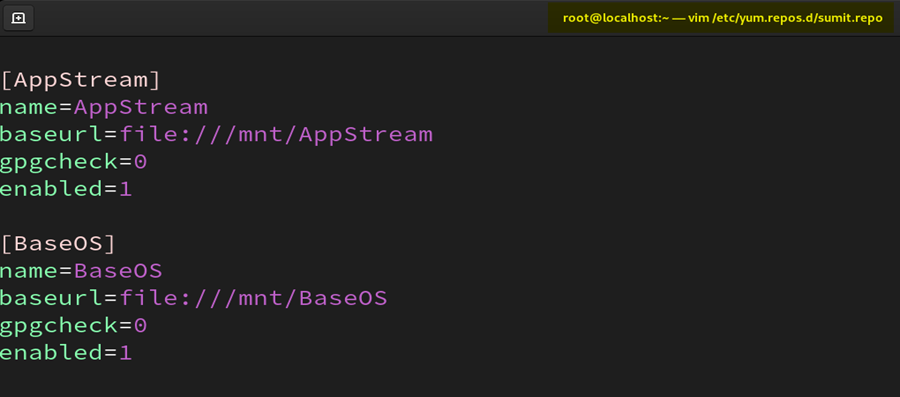

# **Proof of Concept: Hosting Apache Server from User’s Home Directory**

**By: Sumit Nikumbh**


## **Objective**

**This PoC demonstrates how to host a webpage using Apache HTTP Server from a **normal user’s home directory** in RHEL. The example uses user **sumit**.**


## **Steps**

### **1. Verify Available Disks**

```
lsblk
```

- **Lists block devices (hard disks, partitions, DVD).**
- **Ensures** `**/dev/sr0**` **(RHEL DVD) is available.**


### **2. Mount RHEL DVD for Local Yum Repository**

```
mount /dev/sr0 /mnt
```

- **Mounts the DVD on** `**/mnt**`**.**
- **Required for configuring a local repository.**


### **3. Configure Local Yum Repository**

```
vim /etc/yum.repos.d/sumit.repo
```

**Example content inside** `**sumit.repo**


- **Creates a custom repo file pointing to RHEL DVD.**


### **4. Update Yum Cache**

```
yum update
```

- **Refreshes metadata for the newly added repo.**


### **5. Install Apache HTTP Server**

```
yum install httpd* -y
```


- **Installs Apache web server and required packages.**


### **6. Enable and Start Apache Service**

```
systemctl enable --now httpd
```

```
systemctl status httpd
```

- **Enables Apache at boot and starts it immediately.**


### **7. Create User Directory for Hosting**

```
mkdir /home/sumit/public_html
```

```
echo "this is apache server" > /home/sumit/public_html/sumit.html
```

- **Creates** `**public_html**` **folder inside user home.**
- **Creates a test HTML file.**


### **8. Set Proper File Permissions**

```
chmod 755
```

```
chmod 755
```

```
chmod 644
```

- **Ensures Apache can read files inside user directory.**


### **9. Configure User Directory Access in Apache**

**Edit** `**userdir.conf**`**:**

```
vim /etc/httpd/conf/userdir.conf
```

- **1****. Add # infront of UserDir Disable (to make it comment).**
- 2. Remove # infront of UserDir public_html (enables public_html).**
- **3****. If we want to host different file add it here  <directory “/home/*/filename”>**


### **10. Configure SELinux for Apache**

**Enable home directory access:**

```
setsebool -P httpd_enable_homedirs on
```

**Set SELinux context:**

```
semanage fcontext -a -t httpd_sys_content_t '/home/sumit/public_html(/.*)?'
```

```
restorecon -R /home/sumit/public_html
```

**Verify labels:**

```
ls -lZd /home/sumit/public_html
```

```
ls -lZ /home/sumit/public_html/sumit.html
```

```
It should be httpd_user_content_t 
```


### **11. Restart Apache Service**

```
systemctl restart httpd
```

- **Reloads Apache with new configurations.**


### **12. Verify IP Address**

```
ip a
```

- **Get the server IP address (example:** `**192.168.179.133**`**).**


### **13. Test Website Access**

```
curl http://192.168.179.133/~sumit/sumit.html
```

 **Accesses the hosted page from user’s directory.**


## **Result**

**Apache is successfully hosting content from the **user’s home directory** (**`**/home/sumit/public_html/sumit.html**`**).**

