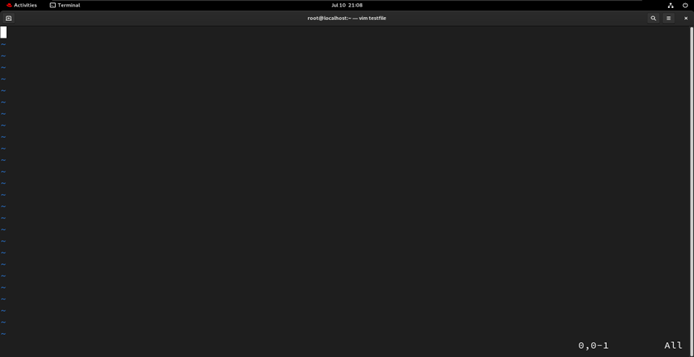

# Introduction to VIM

VIM (Vi IMproved) is a powerful text editor that extends the functionality of the classic `vi` editor found on most UNIX systems. It supports multiple modes and is commonly used for programming, system administration, and file editing tasks.

### To install VIM on RHEL:
```bash
sudo yum install vim -y
To open a file in VIM:
bash
Copy code
vim filename



1. Modes in VIM
VIM operates in three primary modes:

Normal Mode: Default mode for navigation and editing.

Insert Mode: Press i to enter. Used for inserting text.

Command Mode: Press : to enter. Used for running VIM commands.

Press Esc to return to Normal Mode from Insert or Command Mode.

2. Insert Mode Commands
Command	Description
i	Insert before the cursor
I	Insert at the beginning of the line
a	Insert after the cursor
A	Insert at the end of the line
o	Open a new line below the current line
O	Open a new line above the current line

3. Normal Mode Navigation & Editing
Command	Description
h	Move left
l	Move right
j	Move down
k	Move up
0	Move to beginning of line
$	Move to end of line
w	Jump to next word
b	Jump to previous word
G	Go to end of file
gg	Go to beginning of file
10G	Go to line number 10

4. Command Mode (Save/Quit/etc.)
Command	Action
:w	Save file
:q	Quit VIM
:wq	Save and quit
:q!	Force quit without saving
:x	Save and quit (same as :wq)
:set nu	Show line numbers
:set nonu	Hide line numbers

5. Copy, Paste, Undo, Redo
Command	Action
yy	Copy current line
p	Paste below current line
P	Paste above current line
u	Undo last change
Ctrl + r	Redo undone change

6. Delete Commands
Command	Action
x	Delete character under cursor
X	Delete character before cursor
dw	Delete word
dd	Delete current line
d$	Delete from cursor to end of line
d^	Delete from cursor to beginning of line
dG	Delete from cursor to end of file
:10,20d	Delete lines 10 to 20

7. Searching and Highlighting
Command	Action
/word	Search for 'word' forward
?word	Search for 'word' backward
n	Jump to next match
N	Jump to previous match

8. Customization with .vimrc
To make VIM settings persistent across sessions, add configuration options to the ~/.vimrc file:

vim
Copy code
set nu             " Show line numbers
syntax on          " Enable syntax highlighting
set tabstop=4      " Set tab width to 4 spaces
set autoindent     " Enable auto-indentation
set smartindent    " Enable smart indentation

🔚 Summary
This guide covers the essential features of VIM, including modes, navigation, editing, file handling, and configuration. It's a vital tool for Linux administrators and developers alike.